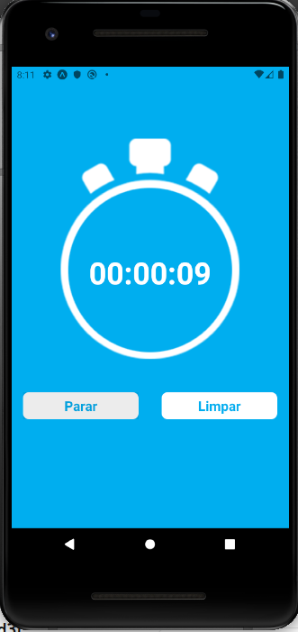

<h1>Cronometro</h1>

<h3>Stacks usadas</h3>
<ul> 
  <li>React-Native</li>
  <li>Expo</li>
</ul>

Um aplicativos de cronômetro, que tem duas funções, limpar, iniciar e salva o ultimo tempo.Usando o javascript puro.

